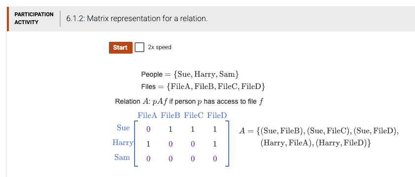

[](https://classroom.github.com/open-in-codespaces?assignment_repo_id=23918139)
# CSV17 — Chapter 7 (Relations) §6.1: Matrix Representation for a Relation

## 1. Background — what is a relation matrix?

A **binary relation** between two finite sets *X* and *Y* can be written as a matrix of `0`s and `1`s. Each row stands for one element of *X*, each column for one element of *Y*. The cell at row *i*, column *j* is `1` exactly when the *i*-th element of *X* is related to the *j*-th element of *Y*.

For this assignment, three people (Sue, Harry, Sam) share access to four files (FileA, FileB, FileC, FileD). The relation **A** on People × Files means "person *p* has access to file *f*".



The access table is:

|       | FileA | FileB | FileC | FileD |
|-------|:-----:|:-----:|:-----:|:-----:|
| Sue   |   0   |   1   |   1   |   1   |
| Harry |   1   |   0   |   0   |   1   |
| Sam   |   0   |   0   |   0   |   0   |

Equivalent relation set (every cell with a 1):

```
A = {(Sue, FileB), (Sue, FileC), (Sue, FileD), (Harry, FileA), (Harry, FileD)}
```

So Sue can open FileB, FileC, FileD but not FileA. Harry can open FileA and FileD only. Sam cannot open anything.

---

## 2. What's already in `main.py`

When you accept the assignment, the starter `main.py` already contains the matrix data, the people/files lists, and a working `main()` driver. The only thing you write is the body of `permission(person, file)`.

```python
people = ['Sue', 'Harry', 'Sam']
Files  = ['FileA', 'FileB', 'FileC', 'FileD']

# rows = people (Sue=0, Harry=1, Sam=2)
# cols = Files (FileA=0, FileB=1, FileC=2, FileD=3)
P = [
    [0, 1, 1, 1],   # Sue
    [1, 0, 0, 1],   # Harry
    [0, 0, 0, 0],   # Sam
]

def permission(person, file):
    """
    ##################################################
    # Complete this function
    ##################################################
    """

def main():
    for p in people:
        for f in Files:
            print(p, '->', f, ':', permission(p, f))

if __name__ == '__main__':
    main()
```

---

## 3. The function you must implement

| Item | Detail |
|---|---|
| **Function name** | `permission` (already declared — do not rename) |
| **Parameter 1** | `person` — a **string**. One of: `'Sue'`, `'Harry'`, `'Sam'`. |
| **Parameter 2** | `file` — a **string**. One of: `'FileA'`, `'FileB'`, `'FileC'`, `'FileD'`. |
| **Return value** | A **boolean** (`True` or `False`). Return `True` if *person* has access to *file*; return `False` otherwise. |
| **Side effects** | None. Do not call `print()` inside this function — `main()` already prints. |

### Algorithm — what your function must do, in plain English

1. Find the **row index** of `person` inside the `people` list. Hint: Python lists have an `.index()` method that does exactly this — `people.index('Harry')` returns `1`.
2. Find the **column index** of `file` inside the `Files` list, the same way.
3. Look up the cell in the matrix: `P[row_index][column_index]`. This is either `0` or `1`.
4. If the cell equals `1`, return `True`. Otherwise return `False`.

> *Tip: Python lets you compare directly — `P[i][j] == 1` is itself a boolean expression you can return.*

### Worked examples

| Call | Look up | Cell value | Returns |
|---|---|:---:|:---:|
| `permission('Sue', 'FileB')` | row=0, col=1 → P[0][1] | 1 | `True` |
| `permission('Sue', 'FileA')` | row=0, col=0 → P[0][0] | 0 | `False` |
| `permission('Harry', 'FileD')` | row=1, col=3 → P[1][3] | 1 | `True` |
| `permission('Sam', 'FileC')` | row=2, col=2 → P[2][2] | 0 | `False` |

### Common mistakes to avoid

- Returning the integer `1` or `0` instead of a boolean. Tests use `is True` / `is False`, so you must return real booleans.
- Hard-coding the answer for each (person, file) pair. Use the matrix `P`; that's why it exists.
- Calling `print()` inside `permission()`. The driver in `main()` already prints. Your function only RETURNS a value.
- Comparing a string directly to a number (`person == 0`). Use `.index()` to convert a string to its position first.

---

## 4. How to run

In a terminal, in the repository root:

```bash
python main.py
```

Expected output (12 lines, one per (person, file) pair):

```
Sue -> FileA : False
Sue -> FileB : True
Sue -> FileC : True
Sue -> FileD : True
Harry -> FileA : True
Harry -> FileB : False
Harry -> FileC : False
Harry -> FileD : True
Sam -> FileA : False
Sam -> FileB : False
Sam -> FileC : False
Sam -> FileD : False
```

---

## 5. How to test

The repository includes 17 automated tests grouped into 4 markers (T1–T4):

```bash
pytest -v               # run all 17 tests at once
pytest -m T1 -v         # only Sue's row (4 tests)
pytest -m T2 -v         # only Harry's row (4 tests)
pytest -m T3 -v         # only Sam's row, all False (4 tests)
pytest -m T4 -v         # only the relation-set cross-check (5 tests)
```

All 17 must show `PASSED` for full credit.

---

## 6. Grading (autograder, 100 pts total)

| Item    | What it checks                                                         | Max |
|---------|------------------------------------------------------------------------|----:|
| Compile | Your `main.py` has no Python syntax errors                             |  10 |
| Run     | Your `main.py` runs without crashing                                   |  10 |
| T1      | Sue's permissions are correct (4 cases)                                |  20 |
| T2      | Harry's permissions are correct (4 cases)                              |  20 |
| T3      | Sam has no access to anything (4 cases)                                |  20 |
| T4      | Cross-check: total of 5 access pairs, set membership matches A         |  20 |
| **Total** |                                                                      | **100** |

You should see ✅ in your GitHub Classroom repo when all six items pass.

---

## 7. Submitting

You don't submit anything in Canvas. Just **commit and push** your code:

```bash
git add main.py
git commit -m "Implement permission()"
git push
```

The autograder runs automatically on every push. Your latest passing run is what gets graded.
