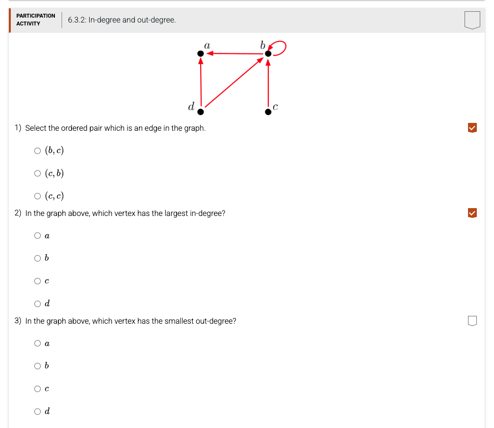

[](https://classroom.github.com/open-in-codespaces?assignment_repo_id=23918140)
# CSV17 — Chapter 7 (Relations) §6.3: Directed Graphs — In-Degree and Out-Degree

## 1. Background — directed graphs and degree

A **directed graph** (digraph) has vertices (nodes) and **directed edges** (ordered pairs `(u, v)` meaning "an arrow from *u* to *v*"). For any vertex *v*:

- **in-degree** of *v* = how many edges *end* at *v* (arrows coming in)
- **out-degree** of *v* = how many edges *start* at *v* (arrows going out)

A **self-loop** at *v* (an edge `(v, v)`) counts as **1 incoming AND 1 outgoing** for that same vertex.

The graph for this assignment has 4 vertices `a, b, c, d` and these 5 directed edges:

```
edges = { (b, a), (b, b), (c, b), (d, a), (d, b) }
```



The same graph stored as an **adjacency matrix** `R`: `R[i][j] = 1` if and only if there is an edge from node *i* to node *j*. Row *i* is the source; column *j* is the destination.

|              | to a (0) | to b (1) | to c (2) | to d (3) |
|--------------|:--------:|:--------:|:--------:|:--------:|
| **from a (0)** |    0    |    0    |    0    |    0    |
| **from b (1)** |    1    |    1    |    0    |    0    |
| **from c (2)** |    0    |    1    |    0    |    0    |
| **from d (3)** |    1    |    1    |    0    |    0    |

Reading the matrix: row *b* has `1`s in columns *a* and *b*, so `b → a` and `b → b` (self-loop) exist. Column *b* has `1`s in rows *b, c, d*, so three different edges arrive at *b*. That means indegree(b) = 3, outdegree(b) = 2.

---

## 2. What's already in `main.py`

The starter file already provides the matrix, the node list, and the `main()` driver. You only write the bodies of three functions.

```python
Node = ['a', 'b', 'c', 'd']     # 'a'=0, 'b'=1, 'c'=2, 'd'=3
R = [
    [0, 0, 0, 0],   # a -> nothing
    [1, 1, 0, 0],   # b -> a, b -> b
    [0, 1, 0, 0],   # c -> b
    [1, 1, 0, 0],   # d -> a, d -> b
]

def edgetest(node1, node2):
    """ ##### Complete this function ##### """

def indegree(node):
    """ ##### Complete this function ##### """

def outdegree(node):
    """ ##### Complete this function ##### """

def main():
    print('Edge Test 1 b->c', edgetest(1, 2))
    print('Edge Test 2 c->b', edgetest(2, 1))
    print('Edge Test 3 c->c', edgetest(2, 2))
    for i in range(len(R)):
        print('Node', Node[i], 'has', indegree(i), 'incoming edges and', outdegree(i), 'outgoing edges.')

if __name__ == '__main__':
    main()
```

---

## 3. The three functions you must implement

### 3.1 `edgetest(node1, node2)`

| Item | Detail |
|---|---|
| **Parameter 1** | `node1` — integer 0..3 (source vertex) |
| **Parameter 2** | `node2` — integer 0..3 (destination vertex) |
| **Return value** | **Boolean.** `True` if there is a directed edge `node1 → node2`, otherwise `False`. |

**Algorithm:** Look up `R[node1][node2]`. If it equals `1`, return `True`; otherwise return `False`. (One line — `return R[node1][node2] == 1` is enough.)

**Worked examples:**

- `edgetest(1, 0)` → row 1 col 0 → R[1][0] = 1 → `True` (edge b → a exists)
- `edgetest(1, 1)` → R[1][1] = 1 → `True` (self-loop b → b exists)
- `edgetest(2, 2)` → R[2][2] = 0 → `False` (no self-loop on c)
- `edgetest(0, 1)` → R[0][1] = 0 → `False` (a has no outgoing edges)

### 3.2 `indegree(node)`

| Item | Detail |
|---|---|
| **Parameter** | `node` — integer 0..3 (the vertex whose in-degree you want) |
| **Return value** | **Integer.** The total number of edges that END at `node` (arrows coming in). |

**Algorithm:** Walk **down column `node`** of `R` and count the `1`s. In Python: loop `i` from 0 to `len(R)-1`, add `1` to a counter every time `R[i][node] == 1`. Return the counter.

```python
def indegree(node):
    count = 0
    for i in range(len(R)):
        if R[i][node] == 1:
            count += 1
    return count
```

**Worked examples:**

- `indegree(0)` → column 0 = [0, 1, 0, 1] → count = 2 (edges b→a and d→a)
- `indegree(1)` → column 1 = [0, 1, 1, 1] → count = 3 (edges b→b, c→b, d→b)
- `indegree(2)` → column 2 = [0, 0, 0, 0] → count = 0
- `indegree(3)` → column 3 = [0, 0, 0, 0] → count = 0

### 3.3 `outdegree(node)`

| Item | Detail |
|---|---|
| **Parameter** | `node` — integer 0..3 (the vertex whose out-degree you want) |
| **Return value** | **Integer.** The total number of edges that START at `node` (arrows going out). |

**Algorithm:** Walk **across row `node`** of `R` and count the `1`s. Loop `j` from 0 to `len(R)-1`, add `1` for each `R[node][j] == 1`. Return the counter.

```python
def outdegree(node):
    count = 0
    for j in range(len(R)):
        if R[node][j] == 1:
            count += 1
    return count
```

**Worked examples:**

- `outdegree(0)` → row 0 = [0, 0, 0, 0] → count = 0 (a has no outgoing edges)
- `outdegree(1)` → row 1 = [1, 1, 0, 0] → count = 2 (b → a, b → b)
- `outdegree(2)` → row 2 = [0, 1, 0, 0] → count = 1 (c → b only)
- `outdegree(3)` → row 3 = [1, 1, 0, 0] → count = 2 (d → a, d → b)

### Common mistakes to avoid

- **edgetest:** swapping rows and columns. `R[node1][node2]` means "edge FROM node1 TO node2". `R[node2][node1]` would test the opposite direction.
- **indegree:** looping the wrong way. For in-degree of *v* you walk DOWN column *v* (vary the row), NOT across row *v*.
- **outdegree:** same mistake mirrored — for out-degree of *v*, walk ACROSS row *v* (vary the column).
- Forgetting that a self-loop counts in BOTH indegree and outdegree.
- Returning `None` (forgetting `return`). Every function must end with `return count` (or equivalent).

---

## 4. How to run

```bash
python main.py
```

Expected output (exact):

```
Edge Test 1 b->c False
Edge Test 2 c->b True
Edge Test 3 c->c False
Node a has 2 incoming edges and 0 outgoing edges.
Node b has 3 incoming edges and 2 outgoing edges.
Node c has 0 incoming edges and 1 outgoing edges.
Node d has 0 incoming edges and 2 outgoing edges.
```

---

## 5. How to test

The repository includes 18 automated tests grouped into 4 markers:

```bash
pytest -v               # all 18 at once
pytest -m T1 -v         # 5 edges that DO exist (edgetest True)
pytest -m T2 -v         # 5 non-edges, including self-loop checks (edgetest False)
pytest -m T3 -v         # in-degree of every node (4 tests)
pytest -m T4 -v         # out-degree of every node (4 tests)
```

All 18 must show `PASSED` for full credit.

---

## 6. Grading (autograder, 100 pts total)

| Item    | What it checks                                                       | Max |
|---------|----------------------------------------------------------------------|----:|
| Compile | Your `main.py` has no Python syntax errors                           |  10 |
| Run     | Your `main.py` runs without crashing                                 |  10 |
| T1      | `edgetest` returns `True` for the 5 edges that exist                 |  20 |
| T2      | `edgetest` returns `False` for 5 non-edges (incl. self-loops)        |  20 |
| T3      | `indegree` is correct for all 4 nodes                                |  20 |
| T4      | `outdegree` is correct for all 4 nodes                               |  20 |
| **Total** |                                                                    | **100** |

You should see ✅ in your GitHub Classroom repo when all six items pass.

---

## 7. Submitting

```bash
git add main.py
git commit -m "Implement edgetest, indegree, outdegree"
git push
```

The autograder runs automatically on every push. You should see ✅ in your GitHub Classroom repo when all six grader items pass.
