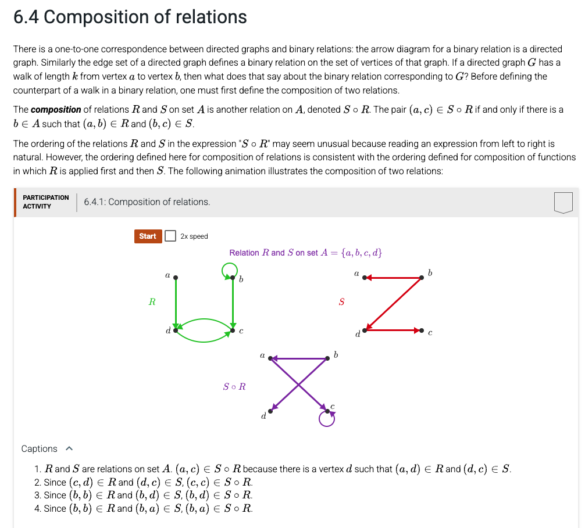

[](https://classroom.github.com/open-in-codespaces?assignment_repo_id=23918144)
# CSV17 — Chapter 7 (Relations) §7.4: Composition of Relations

## 1. Background — what is composition of relations?

Given two binary relations `R` and `S` on the same set, their **composition** `S∘R` ("S after R", read right-to-left) is itself a binary relation defined by:

> `(S∘R)(i, j) = 1` if and only if there exists some intermediate element `k` such that `R(i, k) = 1` AND `S(k, j) = 1`.

In words: `i` is related to `j` in `S∘R` exactly when you can step from `i` to some `k` using `R`, then from `k` to `j` using `S`.

When `R` and `S` are stored as 4×4 adjacency matrices of `0`s and `1`s, the formula becomes:

```
S_R[i][j] = OR over k of (R[i][k] AND S[k][j])
```

So you walk row `i` of `R`. Every column `k` where `R[i][k] = 1` is a "candidate intermediate". For each such `k`, look at row `k` of `S` and OR its bits into row `i` of the result.



---

## 2. What's already in `main.py`

When you accept the assignment, the starter `main.py` provides:

- `SIZE = 4`
- A `composition(R, S)` skeleton with the result matrix `S_R` initialized to all zeros
- A `main()` driver that runs Participation Activity 7.4.1 and 7.4.2 and prints both result matrices

You write only the body of `composition(R, S)`.

```python
SIZE = 4

def composition(R, S):
    S_R = [[0] * SIZE for _ in range(SIZE)]
    ##################################################
    # Code your program here
    # Complete the relation S_R based on S∘R
    ##################################################
    return S_R
```

---

## 3. The function you must implement

| Item | Detail |
|---|---|
| **Function name** | `composition` (already declared — do not rename) |
| **Parameter 1** | `R` — a 4×4 list-of-lists of `0`/`1` (a relation matrix) |
| **Parameter 2** | `S` — a 4×4 list-of-lists of `0`/`1` (a relation matrix) |
| **Return value** | A new 4×4 list-of-lists of `0`/`1` representing the composition `S∘R` |
| **Side effects** | Must NOT modify `R` or `S`. Build a fresh result matrix. |

### Algorithm — three nested loops

```
for i in 0..3:
    for j in 0..3:
        for k in 0..3:
            if R[i][k] == 1 and S[k][j] == 1:
                S_R[i][j] = 1
                break    # one valid k is enough; move on to the next (i, j)
```

**Why the break?** As soon as you find ONE intermediate `k` that works for the pair `(i, j)`, you know `S_R[i][j] = 1`. Trying more `k`s can't change that, so just stop and move on.

### Worked example — Participation Activity 7.4.1

Inputs:

```
R = [[0,0,0,1],     S = [[0,0,0,0],
     [0,1,1,0],          [1,0,0,1],
     [0,0,0,1],          [0,0,0,0],
     [0,0,1,0]]          [0,0,1,0]]
```

Expected output of `composition(R, S)`:

```
[[0, 0, 1, 0],
 [1, 0, 0, 1],
 [0, 0, 1, 0],
 [0, 0, 0, 0]]
```

Reasoning for `S_R[0][2]`: Row 0 of `R` is `[0, 0, 0, 1]` — the only `k` with `R[0][k] = 1` is `k = 3`. Look at row 3 of `S`: `[0, 0, 1, 0]`. Column 2 is `1`, so `S_R[0][2] = 1`. ✓

### Common mistakes to avoid

- **Swapping `R` and `S`.** The composition `S∘R` (S after R) is NOT the same as `R∘S`. The order matters — if you write `R[k][j]` instead of `S[k][j]`, you'll compute the wrong relation.
- **Mutating the inputs.** Don't write `R[i][j] = ...`. Build a fresh result matrix and return it.
- **Forgetting to OR the bits.** Once `S_R[i][j]` is set to `1`, leave it. Don't reset it on the next `k` iteration.
- **Using `+` instead of `or`.** `1 + 1 = 2`, not `1`. The result must contain only `0` or `1`. Either `break` early (recommended), or use `S_R[i][j] = S_R[i][j] or (R[i][k] and S[k][j])`.

---

## 4. How to run

```bash
python main.py
```

Expected output (exact):

```
******** Test 1: 7.4.1 Participation Activity
[0, 0, 1, 0]
[1, 0, 0, 1]
[0, 0, 1, 0]
[0, 0, 0, 0]
******** Test 2: 7.4.2 Participation Activity
[0, 0, 1, 1]
[0, 0, 0, 0]
[0, 0, 0, 0]
[1, 0, 0, 0]
```

---

## 5. How to test

The repository includes 17 automated tests grouped into 4 markers:

```bash
pytest -v               # all 17
pytest -m T1 -v         # PA 7.4.1 — full matrix and per-row checks (4 tests)
pytest -m T2 -v         # PA 7.4.2 — full matrix and per-row checks (4 tests)
pytest -m T3 -v         # zero / identity / shape sanity (4 tests)
pytest -m T4 -v         # specific cells + no-mutation check (5 tests)
```

All 17 must show `PASSED` for full credit.

---

## 6. Grading (autograder, 100 pts total)

| Item    | What it checks                                          | Max |
|---------|---------------------------------------------------------|----:|
| Compile | `main.py` has no Python syntax errors                   |  10 |
| Run     | `python main.py` runs without crashing                  |  10 |
| T1      | PA 7.4.1 expected matrix is correct (4 cases)           |  20 |
| T2      | PA 7.4.2 expected matrix is correct (4 cases)           |  20 |
| T3      | Algebraic properties: 0∘R = R∘0 = 0, I∘R = R∘I = R, output is 4×4 of 0/1 |  20 |
| T4      | Specific cells with reasoned intermediates + no input mutation | 20 |
| **Total** |                                                       | **100** |

You should see ✅ in your GitHub Classroom repo when all six items pass.

---

## 7. Submitting

```bash
git add main.py
git commit -m "Implement composition()"
git push
```

The autograder runs automatically on every push.
