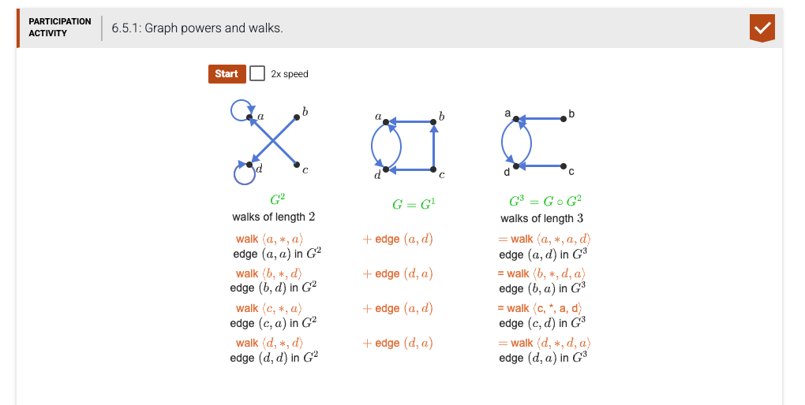

[](https://classroom.github.com/open-in-codespaces?assignment_repo_id=23918153)
# CSV17 — Chapter 7 (Relations) §7.5: Graph Powers and Walks

## 1. Background — what is a graph power?

In a directed graph `G`, a **walk of length n** from vertex `u` to vertex `v` is a sequence

```
u = w_0  →  w_1  →  w_2  →  ...  →  w_n = v
```

where every consecutive pair is a directed edge. The **n-th power** of a graph collects, for every starting vertex `u`, the set of vertices `v` reachable from `u` via at least one walk of length **exactly** `n`.

Your task is to compute that set, recursively, for one starting vertex at a time.

> `graph_power(G, key, n)` returns the list of distinct nodes `v` such that there is a walk `key → … → v` of exactly `n` edges.



For this assignment the graph is a 4-vertex digraph stored as an adjacency matrix `G1`:

```python
# 'a' = 0, 'b' = 1, 'c' = 2, 'd' = 3
G1 = [
    [0, 0, 0, 1],   # a -> d
    [1, 0, 0, 0],   # b -> a
    [0, 1, 0, 1],   # c -> b, c -> d
    [1, 0, 0, 0],   # d -> a
]
```

So edges are: `a→d`, `b→a`, `c→b`, `c→d`, `d→a`.

---

## 2. What's already in `main.py`

The starter file provides the matrix `G1`, an empty `graph_power` function, and a `main()` driver that computes the 3-step graph and prints it as a new matrix `NewGraph`.

```python
G1 = [
    [0, 0, 0, 1],
    [1, 0, 0, 0],
    [0, 1, 0, 1],
    [1, 0, 0, 0],
]

def graph_power(G, key, n):
    """ ##### Complete this function ##### """

def main():
    NewGraph = [[0]*len(G1) for _ in range(len(G1))]
    for key in range(len(G1)):
        retval = graph_power(G1, key, 3)
        for val in retval:
            NewGraph[key][val] = 1
    print(NewGraph)
```

You write only the body of `graph_power`.

---

## 3. The function you must implement

| Item | Detail |
|---|---|
| **Function name** | `graph_power` (already declared — do not rename) |
| **Parameter 1** | `G` — adjacency matrix (list-of-lists of `0`/`1`). `G[i][j]==1` iff edge `i → j`. |
| **Parameter 2** | `key` — integer in `0 .. len(G)-1`, the starting vertex. |
| **Parameter 3** | `n` — non-negative integer, the walk length. |
| **Return value** | A `list[int]` of distinct vertex indices reachable from `key` via a walk of **exactly** `n` edges, in **ascending order**. |

### Recursive structure

The function MUST be recursive (per the assignment). The recursion has a clean base case and one recursive step:

| Case | What to return |
|---|---|
| `n == 0` | `[key]` — the only length-0 walk from `key` ends at `key` itself. |
| `n > 0`  | The union over every direct neighbor `w` of `key` of `graph_power(G, w, n-1)`. |

Why this works: a length-`n` walk from `key` is "step to a neighbor `w`, then take a length-`(n-1)` walk from `w`." Combining over all neighbors gives every endpoint reachable in exactly `n` steps.

### Algorithm in code

```python
def graph_power(G, key, n):
    if n == 0:
        return [key]
    seen = set()
    for w in range(len(G)):
        if G[key][w] == 1:           # w is a direct neighbor of key
            for v in graph_power(G, w, n - 1):
                seen.add(v)          # union (dedup automatic)
    return sorted(seen)              # ascending order, no duplicates
```

### Worked examples (n = 1)

Direct neighbors only:

| Call | Reasoning | Returns |
|---|---|---|
| `graph_power(G1, 0, 1)` | row 0 of G1 = `[0,0,0,1]` → only edge a→d | `[3]` |
| `graph_power(G1, 1, 1)` | row 1 = `[1,0,0,0]` → only edge b→a | `[0]` |
| `graph_power(G1, 2, 1)` | row 2 = `[0,1,0,1]` → c→b and c→d | `[1, 3]` |
| `graph_power(G1, 3, 1)` | row 3 = `[1,0,0,0]` → only edge d→a | `[0]` |

### Worked examples (n = 2)

Walks of length 2:

| Call | Walks | Returns |
|---|---|---|
| `graph_power(G1, 0, 2)` | 0 → 3 → 0 | `[0]` |
| `graph_power(G1, 1, 2)` | 1 → 0 → 3 | `[3]` |
| `graph_power(G1, 2, 2)` | 2 → 1 → 0  AND  2 → 3 → 0 | `[0]` |
| `graph_power(G1, 3, 2)` | 3 → 0 → 3 | `[3]` |

### Common mistakes to avoid

- **Forgetting the base case.** Without `if n == 0: return [key]` your recursion runs forever and Python eventually raises `RecursionError`.
- **Returning duplicates.** If two different neighbors `w1, w2` both lead to vertex `v` in `n-1` more steps, `v` should appear only once. Use a `set` to deduplicate.
- **Returning unsorted.** Return `sorted(seen)` so tests can compare to `[0]` rather than `[0]` vs `[0]` in a different order.
- **Using `[key]` for `n=1` instead of looping over neighbors.** That would skip the actual edge step.
- **Mutating `G`.** Just read from `G`. Don't change any of its rows or cells.

---

## 4. How to run

```bash
python main.py
```

Expected output (exact):

```
The Origin Key is 0  ----> 
ret val [3]
The Origin Key is 1  ----> 
ret val [0]
The Origin Key is 2  ----> 
ret val [3]
The Origin Key is 3  ----> 
ret val [0]
[[0, 0, 0, 1], [1, 0, 0, 0], [0, 0, 0, 1], [1, 0, 0, 0]]
```

The final matrix is the graph "G1 to the 3rd power" — entry `[i][j] = 1` iff there is a walk from `i` to `j` of length exactly 3.

---

## 5. How to test

The repository includes 17 automated tests grouped into 4 markers:

```bash
pytest -v               # all 17
pytest -m T1 -v         # n=1 (direct neighbors) for every starting vertex (4 tests)
pytest -m T2 -v         # n=2 walks for every starting vertex (4 tests)
pytest -m T3 -v         # n=3 walks + the n=0 base case (5 tests)
pytest -m T4 -v         # structural properties (no-edge, self-loop, sorted, NewGraph) (4 tests)
```

All 17 must show `PASSED` for full credit.

---

## 6. Grading (autograder, 100 pts total)

| Item    | What it checks                                              | Max |
|---------|-------------------------------------------------------------|----:|
| Compile | `main.py` has no Python syntax errors                       |  10 |
| Run     | `python main.py` runs without crashing                      |  10 |
| T1      | n=1 — direct neighbors are correct for all 4 vertices       |  20 |
| T2      | n=2 — walks of length 2 are correct for all 4 vertices      |  20 |
| T3      | n=3 walks + the n=0 base case work correctly                |  20 |
| T4      | Empty / self-loop / sorted-no-duplicates / NewGraph matrix  |  20 |
| **Total** |                                                           | **100** |

You should see ✅ in your GitHub Classroom repo when all six items pass.

---

## 7. Submitting

```bash
git add main.py
git commit -m "Implement graph_power()"
git push
```

The autograder runs automatically on every push.
